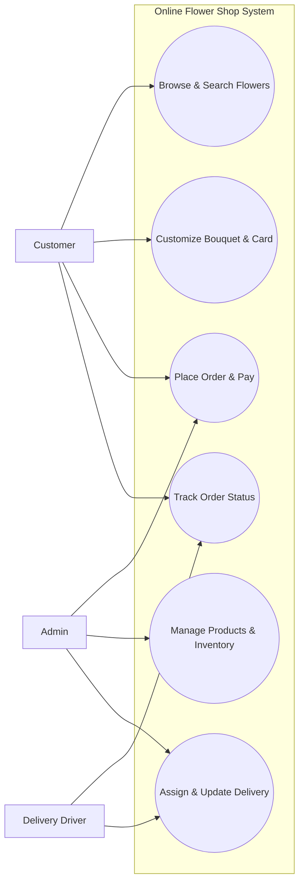
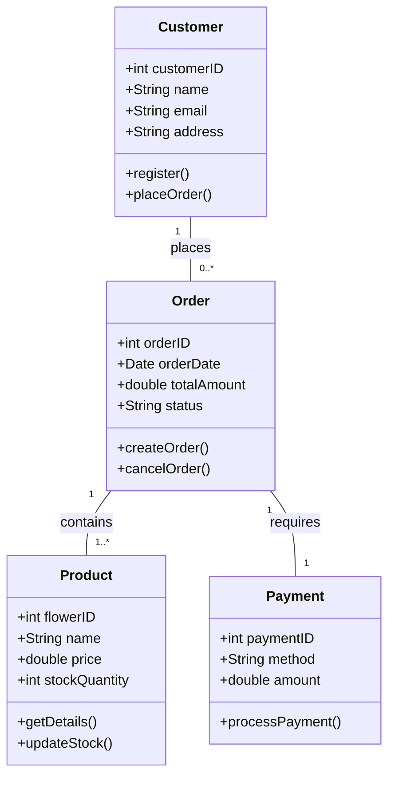
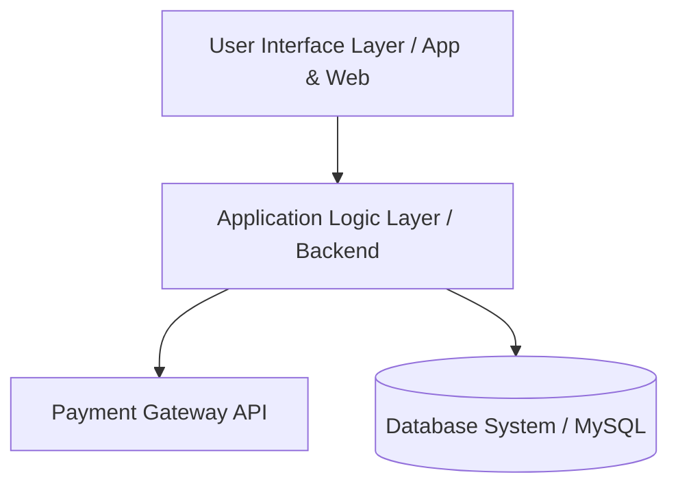

وثيقة مواصفات وتصميم النظام البرمجي (SRS Document)
مشروع: متجر الزهور الإلكتروني (Online Flower Shop System)

 الطالبة: بيان أحمد عبد المعطي.                          
 الدكتور:أمجد فهمي 
  

1. المقدمة ونظرة عامة (Introduction & Overview)

يهدف هذا المشروع إلى تحويل عملية شراء وتنسيق الزهور والهدايا من المتاجر التقليدية إلى نظام تجارة إلكترونية متكامل. يوفر النظام تجربة سلسة للعملاء لتصفح المنتجات، وتخصيص باقات الزهور وإرفاق بطاقات التهنئة، وإتمام عمليات الدفع والمتابعة، بالإضافة إلى إدارة كاملة للمتجر والمخزون وعمليات التوصيل.

2. جمع وتحليل المتطلبات (Requirements Analysis)

 أ. المتطلبات الوظيفية (Functional Requirements)
تصف الوظائف المباشرة التي يجب أن يقدمها النظام للمستخدمين:    
إدارة الحسابات: تسجيل حساب جديد للعميل، تسجيل الدخول، وإدارة الملف الشخصي والعناوين.                              
تصفح والبحث عن الزهور:البحث بأسماء الزهور، التصفية حسب المناسبة أو السعر أو اللون.                             
تخصيص الباقات (Customize Bouquet): إمكانية اختيار نوع الزهور، التغليف، وإضافة بطاقة إهداء بنص مخصص.               
إدارة الطلبات والدفع: إضافة المنتجات إلى السلة، اختيار موقع التوصيل، والدفع الإلكتروني المشفر.                        
تتبع حالة الطلب:متابعة مرحلة الطلب (قيد التجهيز، خرج للتوصيل، تم التسليم).                                         
لوحة تحكم الإدارة (Admin Dashboard):إضافة وتعديل المنتجات، متابعة المخزون، وتعيين السائقين للتوصيل.             

ب. المتطلبات غير الوظيفية (Non-Functional Requirements)
تحدد معايير الجودة والأداء للنظام:                            
الأمان (Security):تشفير بيانات المستخدمين وعمليات الدفع باستخدام بروتوكولات HTTPS و SSL.                      
الأداء والسرعة (Performance):استجابة شاشات المتجر خلال أقل من ثانيتين تحت الضغط المعتاد.                       
سهولة الاستخدام (Usability):تصميم واجهات بسيطة وجذابة متوافقة مع جميع أجهزة الموبايل والحاسوب.                    
الموثوقية (Reliability):ضمان عمل النظام بنسبة تشغيل عالية (Availability 99.9%).                                        

3. التحليل والتصميم باستخدام مخططات UML.      

 أ. مخطط حالات الاستخدام (Use Case Diagram)
يوضح الأطراف والوظائف المتاحة لكل طرف داخل المتجر:

---

ب. مخطط الفئات (Class Diagram)
يوضح الهيكلية البرمجية للفئات والخصائص والعمليات والعلاقات بينها:

---

ج. مخطط المكونات والمعمارية (Component Architecture)
يوضح الطبقات البرمجية التي يتكون منها النظام:                                                                                                                                                          

---

4. تصميم هيلكية الواجهات (UI/UX Mockups Structure)

يتكون نظام متجر الزهور من الواجهات الرئيسية التالية:
1. الشاشة الرئيسية (Home Page): لعرض العروض الموسمية، والأقسام الأكثر مبيعاً.
2. شاشة تخصيص الباقة (Customization Screen):واجهة تفاعلية تمكّن العميل من تحديد أنواع الزهور والألوان وكتابة كرت الإهداء.
3. شاشة سلة التسوق والدفع (Checkout Screen):لاستعراض المشتريات وتحديد موقع الاستلام ووسيلة الدفع.
4. لوحة تحكم الإدارة (Dashboard): شاشة مخصصة للمدير لإدارة المنتجات والطلبات والتقارير.

